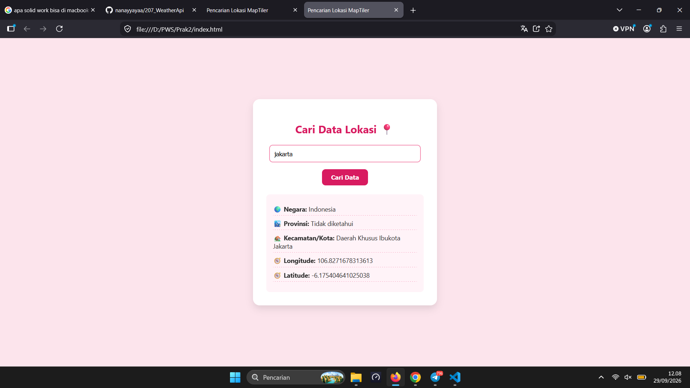

# Tugas Pencarian Lokasi MapTiler API 🌍

**Nama:** Rael Alfath
**NIM:** 2026012046
**Program Studi:** Teknologi Informasi

Ini adalah project sederhana menggunakan HTML, CSS, dan Vanilla JavaScript untuk mencari data koordinat (Longitude & Latitude) serta detail wilayah dari sebuah lokasi.
Data diambil menggunakan API Geocoding dari [MapTiler](https://api.maptiler.com/).

## Fitur:
1. Input lokasi manual oleh user.
2. Menampilkan Negara, Provinsi, Kecamatan, Longitude, dan Latitude.

## Screenshot Hasil GET Data 📸

